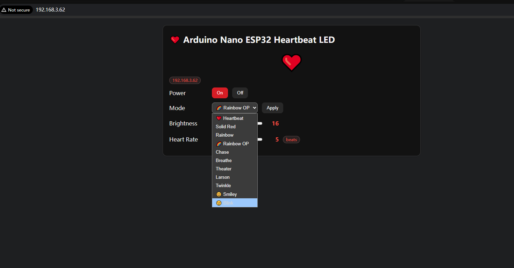
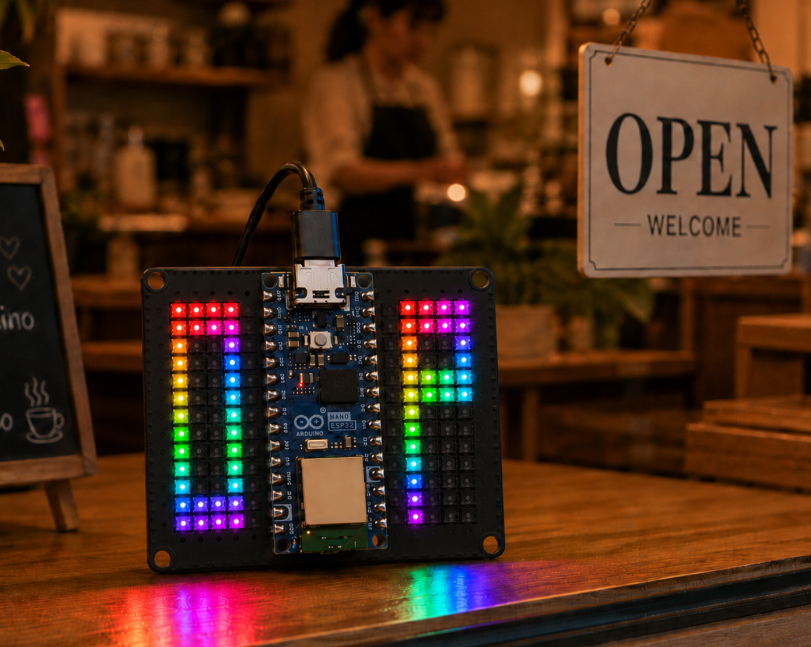

# RGB LED Matrix Shield for Arduino Nano ESP32

RGB LED Matrix Shield for Arduino Nano ESP32  WiFi-controlled 13×8 WS2812B LED matrix shield with 104 RGB LEDs. Features web-based control, multiple lighting effects (rainbow, heartbeat, smiley, chase, breathe), and adjustable brightness/speed via built-in HTTP server.

## Features

- **104 WS2812B LEDs** in 13×8 matrix layout with serpentine column wiring
- **WiFi web interface** for real-time control from any browser
- **Multiple built-in effects**: Rainbow, Heartbeat, Chase, Breathe, Theater, Larson, Twinkle, Smiley (static/blink), and Rainbow OP
- **Adjustable brightness** and speed via web UI
- **RMT peripheral** for reliable WS2812B timing

## Hardware

- Arduino Nano ESP32 (Nano Nora)
- 104× WS2812B RGB LEDs (D11 data pin)
- 8×13 matrix with serpentine column wiring

## Web API

| Endpoint | Description |
|----------|-------------|
| `/api/state` | Get current state (effect, brightness, speed) |
| `/api/power?on=1/0` | Power on/off |
| `/api/effect?name=` | Set effect mode |
| `/api/brightness?v=0-255` | Set brightness |
| `/api/speed?v=1-10` | Set animation speed |

## Effects

- `rainbow` — Classic rainbow flow
- `rainbow_op` — Rainbow-colored "OP" letters with hollow interior
- `heartbeat` — Pulsing red heart
- `smiley` / `smiley_blink` — Yellow smiley with red eyes
- `chase`, `breathe`, `theater`, `larson`, `twinkle` — Standard patterns
- `solid` — Static red

## Wiring

| LED Matrix | Nano ESP32 |
|------------|-----------|
| DIN        | D11       |
| 5V         | 5V        |
| GND        | GND       |

## Wiki

[52Pi Wiki](https://wiki.52pi.com/index.php?title=EP-0263)
